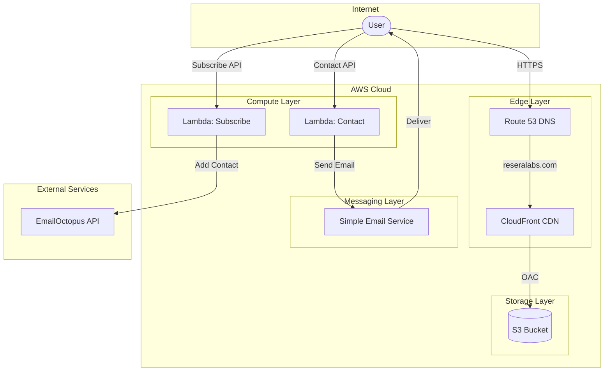
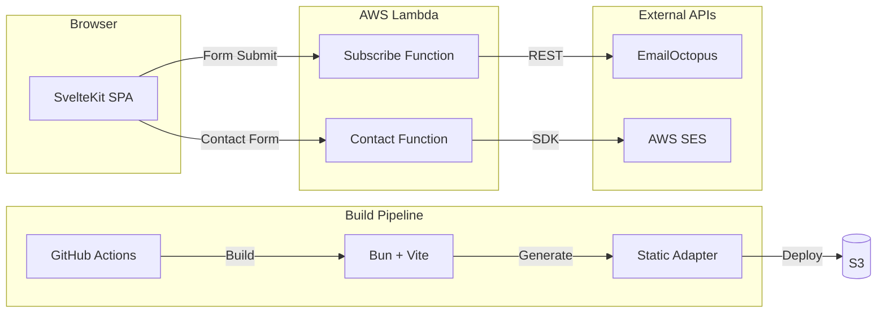
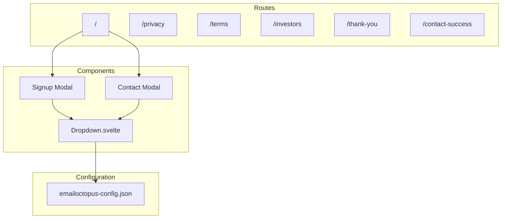

# ReseraLabs Website

Coming soon page for [ReseraLabs](https://reseralabs.com).

## Tech Stack

- **Framework**: SvelteKit with TypeScript
- **Styling**: Tailwind CSS v4
- **Build**: Vite + Bun
- **Hosting**: AWS S3 + CloudFront
- **CI/CD**: GitHub Actions

## Enterprise Architecture



The infrastructure is fully serverless on AWS:

- **Route 53** handles DNS for the `reseralabs.com` domain
- **CloudFront** serves as the CDN, providing global edge caching and HTTPS termination
- **S3** stores the static site assets, accessed via Origin Access Control (OAC) - the bucket is not public
- **Lambda** functions handle form submissions:
  - **Subscribe** - adds contacts to EmailOctopus mailing list with industry segmentation
  - **Contact** - sends inquiry emails via SES to the team
- **SES** delivers transactional emails from the contact form
- **EmailOctopus** manages the mailing list and email campaigns

## Software Architecture



The application follows a static-first architecture:

- **SvelteKit** with the static adapter pre-renders all pages at build time
- **Bun** is used as the package manager and runtime for fast builds
- **Vite** handles bundling, hot module replacement, and optimizations
- **GitHub Actions** automates the CI/CD pipeline:
  1. Syncs EmailOctopus field configuration from API
  2. Commits config back to repo if changed
  3. Builds the static site
  4. Deploys to S3 via OIDC authentication (no stored credentials)
  5. Invalidates CloudFront cache
- **Scheduled Sync** - A separate workflow runs daily at 6am UTC to check for EmailOctopus config changes. If changes are detected, it commits and pushes, which triggers a deploy
- **Lambda Function URLs** provide simple HTTPS endpoints without API Gateway overhead
- Form submissions are proxied through Lambda to keep API keys secure

## Application Structure



The SvelteKit app is organized as follows:

- **Routes** - Each page is a separate route with its own `+page.svelte`
- **Components** - Reusable UI components like the custom `Dropdown` for form selects
- **Modals** - Signup and Contact forms share the same dropdown configuration
- **Configuration** - EmailOctopus field definitions (org types, industries) are synced from the API at build time and shared across forms. If the config changes, it's automatically committed back to the repo

## Environment Variables

### Local Development (`.env`)

| Variable | Description |
|----------|-------------|
| `EMAILOCTOPUS_API_KEY` | API key for EmailOctopus (used by sync script) |
| `EMAILOCTOPUS_LIST_ID` | EmailOctopus mailing list ID |
| `VITE_SUBSCRIBE_API_URL` | Lambda Function URL for email subscription |
| `VITE_CONTACT_API_URL` | Lambda Function URL for contact form |

### GitHub Actions

#### Secrets

| Secret | Description |
|--------|-------------|
| `AWS_ROLE_ARN` | IAM role ARN for OIDC authentication |
| `EMAILOCTOPUS_API_KEY` | API key for EmailOctopus |
| `EMAILOCTOPUS_LIST_ID` | EmailOctopus mailing list ID |

#### Variables

| Variable | Description |
|----------|-------------|
| `AWS_REGION` | AWS region (e.g., `us-east-1`) |
| `S3_BUCKET_NAME` | S3 bucket for static site hosting |
| `CLOUDFRONT_DISTRIBUTION_ID` | CloudFront distribution ID for cache invalidation |
| `SUBSCRIBE_API_URL` | Lambda Function URL for email subscription |
| `CONTACT_API_URL` | Lambda Function URL for contact form |

## Development

```sh
bun install
bun run dev
```

## Build

```sh
bun run build
```

## Deployment

Push to `main` triggers automatic deployment via GitHub Actions.

See [AWS_SETUP.md](./AWS_SETUP.md) for infrastructure setup.
